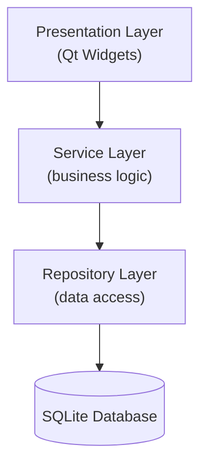

<div align="center">

# 🏢 Mess Manager

**A desktop Mess Management System built with C++ and Qt for managing members, meals, expenses, bills, individual ledgers, and monthly reports.**


</div>

---

## 📖 Project Overview

Mess Manager is a university group project: a desktop application for running a shared mess (a group dining arrangement). It tracks who is a member, how many meals each member eats, what the mess spends, and how much each member owes each month.

The application uses a strict layered architecture (UI → Service → Repository → SQLite) so that every part of the codebase has one clear responsibility and a five-person team can work in parallel with minimal conflicts.

> ⚠️ **Status:** the project is under active development. Features listed below describe the intended scope of the application unless explicitly marked otherwise. See [Project Status](#-project-status).

## 🎯 Project Objectives

- Build a production-oriented desktop application with C++17 and Qt 6.
- Apply object-oriented design, separation of concerns, and layered architecture.
- Persist data locally with SQLite using prepared statements only.
- Automate monthly meal-rate and bill calculation.
- Practise professional team collaboration with Git, feature branches, and Pull Requests.

## ✨ Key Features

| Area | Scope |
|---|---|
| 🔑 **Authentication** | Login/logout, user management, role-based access control |
| 👥 **Members** | Add/update, search, activate/deactivate, contact and room information |
| 🍱 **Meals** | Breakfast, lunch, and dinner tracking; daily and monthly totals |
| 💸 **Expenses** | Record expenses with categories and descriptions; monthly aggregation |
| 💳 **Ledger** | Payments, bill charges, deposits, adjustments, balances, transaction history |
| 🧮 **Bill Calculation** | Monthly meal rate, individual meal cost, fixed costs, bill finalization |
| 📊 **Dashboard** | Active members, today's meals, monthly expenses, meal rate, recent activity |
| 📑 **Reports** | Monthly summaries, individual statements, expense and meal summaries, CSV/PDF export |

## 🏛️ System Architecture



**Dependency direction: UI → Service → Repository → Database.** Dependencies only point downward.

| Layer | Responsibility | Must not |
|---|---|---|
| Presentation | Render UI, capture input, call services | Execute SQL, contain business rules |
| Service | Validation, calculations, business rules | Reference Qt UI classes or run SQL directly |
| Repository | Prepared SQL statements, map rows to model objects | Contain business logic |
| SQLite | Persistent storage and constraints | — |

Detailed design lives in the [Wiki](#-documentation).

## 🧩 Core Modules

| # | Module | Purpose |
|---|---|---|
| 1 | Authentication | Verifies users and controls access by role |
| 2 | Member Management | Manages the lifecycle and profile of mess members |
| 3 | Meal Management | Records daily meals and computes monthly totals |
| 4 | Expense Management | Logs mess expenses and aggregates them by month |
| 5 | Individual Ledger | Tracks each member's transactions and running balance |
| 6 | Bill Calculation | Computes meal rate and monthly bills, then finalizes them |
| 7 | Dashboard | Shows a live summary of key metrics |
| 8 | Monthly Reports | Produces monthly and per-member statements and exports |

## 🛠️ Technology Stack

| Technology | Role |
|---|---|
| C++17 | Application language |
| Qt 6 (Widgets) | Desktop GUI |
| Qt SQL | Database access API |
| SQLite | Local persistent storage |
| CMake | Build system |
| Git / GitHub | Version control and collaboration |

## 📂 Project Structure

> The structure below is the **planned structure** from the architecture design. Folders and files are added as modules are implemented; check the repository's Code tab for the current state.

```text
mess_manager/
├── CMakeLists.txt
├── README.md
├── src/
│   ├── main.cpp
│   ├── core/            # database management, exceptions
│   ├── utils/           # security, date, formatting helpers
│   ├── models/          # plain data structures
│   ├── repositories/    # SQL access (prepared statements)
│   ├── services/        # business logic
│   └── ui/              # Qt Widgets, dialogs, windows
├── assets/              # icons, stylesheets
└── tests/               # planned
```

## 💾 Database Overview

Mess Manager stores its data locally in a single [SQLite](https://www.sqlite.org/) database file accessed through Qt SQL. All queries use prepared statements, and foreign keys are enforced.

| Table | Holds |
|---|---|
| `users` | Application accounts, roles, hashed passwords |
| `members` | Mess members, contact and room information, status |
| `meals` | Daily breakfast, lunch, and dinner counts per member |
| `expenses` | Mess expenses with category, amount, and date |
| `ledger_transactions` | Payments, bill charges, deposits, adjustments |
| `bills` | Monthly calculated bills per member |

The full schema is documented in the Wiki rather than in this README.

## 👥 Team Responsibilities

| Developer | Responsibilities |
|---|---|
| **Developer 1** | Architecture, Authentication, Dashboard, Database/Core infrastructure |
| **Developer 2** | Member Management, Meal Management |
| **Developer 3** | Expense Management, Individual Ledger |
| **Developer 4** | Bill Calculation Engine |
| **Developer 5** | Monthly Reports, UI/UX integration |

## 🌿 Git & Contribution Workflow

```text
main
  ↓
dev/<developer>
  ↓
feature/<task>
```

1. Never commit directly to `main`.
2. Never develop directly on `dev/*` branches.
3. Create a `feature/<task>` branch for each individual task.
4. Open a Pull Request when the task is ready.
5. Have the changes reviewed before merging.
6. Keep `main` stable at all times.

## 📋 Development Requirements

- A C++17-capable compiler
- Qt 6 (Widgets and SQL modules)
- CMake
- Git

## 🚀 Build & Run

Build and run instructions are being finalized and will be added here once the application is buildable from the repository. Until then, no supported build commands are documented.

## 🧪 Testing

Automated testing is planned but not yet implemented. This section will be updated when tests are added to the repository.

## 📚 Documentation

Detailed architecture and design documentation (module design, database schema, data flows) is maintained in the project **[GitHub Wiki](https://github.com/mdismail-nub/mess-manager/wiki)**.

## 🗺️ Roadmap

- [ ] Repository setup
- [ ] Core infrastructure
- [ ] Authentication
- [ ] Members
- [ ] Meals
- [ ] Expenses
- [ ] Ledger
- [ ] Bill calculation
- [ ] Dashboard
- [ ] Reports
- [ ] Testing
- [ ] MVP release

> Tick items off as they are completed and merged into `main`.

## 📌 Project Status

🚧 **Under development.** The project is in its early stages; modules are being built by the team on feature branches. Expect incomplete functionality and changes to structure.

## 🎓 Academic Project

Mess Manager is a university group project. It demonstrates object-oriented programming, GUI development, database management, software architecture, Git, and team collaboration.

## 📄 License

Licensing will be finalized later.
