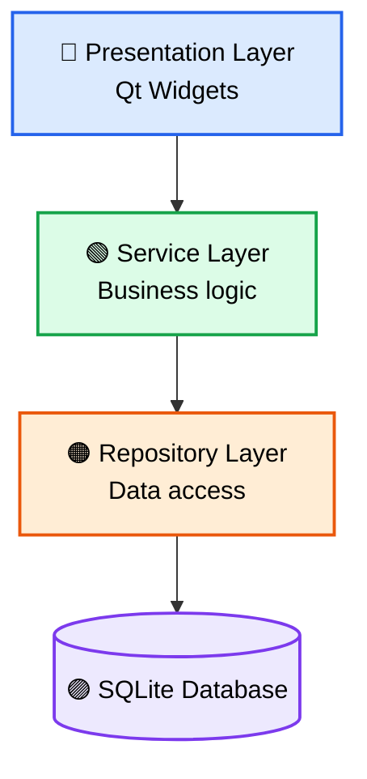
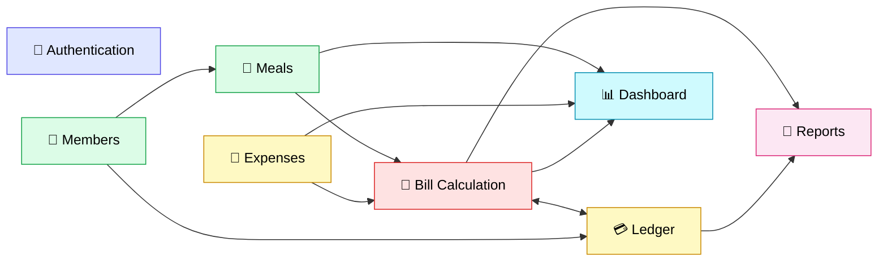
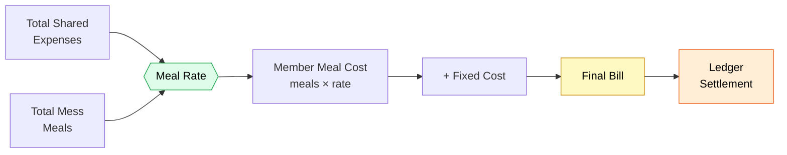
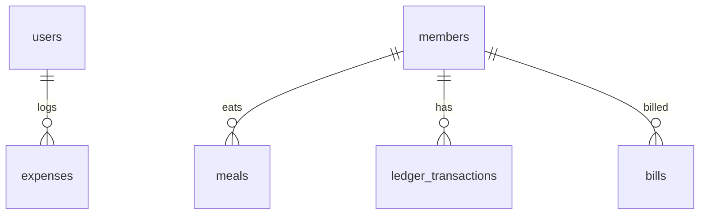
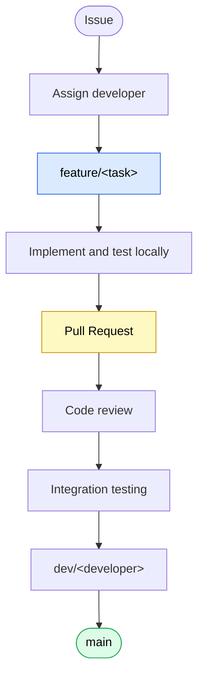

<div align="center">

# 🏢 Mess Manager

### A desktop Mess Management System for members, meals, expenses, bills, ledgers, and monthly reports


[Overview](#-project-overview) ·
[Features](#-key-features) ·
[Architecture](#-system-architecture) ·
[Modules](#-core-modules) ·
[Database](#-database-overview) ·
[Team](#-team) ·
[Workflow](#-git--contribution-workflow) ·
[Roadmap](#-roadmap)

</div>

---

## 📖 Project Overview

**Mess Manager** is a desktop application built with **C++17** and **Qt 6** for running a shared mess (a group dining arrangement). It tracks who the members are, how many meals each person eats, what the mess spends, and what each member owes every month.

The code follows a strict **layered architecture** (UI → Service → Repository → SQLite) so a five-person team can build modules in parallel without breaking each other's work.

> 🚧 **Heads up:** the project is **under active development**. The feature list below describes the **intended scope**, not a list of finished features.

## 🎯 Project Objectives

- 🧱 Build a production-oriented desktop application with C++17 and Qt 6
- 🧩 Apply OOP, separation of concerns, and layered architecture
- 💾 Persist data locally in SQLite using prepared statements only
- 🧮 Automate monthly meal-rate and bill calculation
- 🤝 Practise professional teamwork with Git, feature branches, and Pull Requests

## ✨ Key Features

| | Module | Intended scope |
|---|---|---|
| 🔑 | **Authentication** | Login/logout, user management, role-based access |
| 👥 | **Members** | Add/edit, search, activate/deactivate, contact and room details |
| 🍱 | **Meals** | Breakfast, lunch, dinner; daily and monthly tracking |
| 💸 | **Expenses** | Record expenses with categories and descriptions; monthly totals |
| 💳 | **Ledger** | Payments, deposits, bill charges, adjustments, balances, history |
| 🧮 | **Bill Calculation** | Meal rate, individual meal cost, fixed costs, preview, finalization |
| 📊 | **Dashboard** | Active members, today's meals, monthly expenses, meal rate, recent activity |
| 📑 | **Reports** | Monthly summaries, member statements, expense and meal summaries, CSV/PDF export |

## 🏛️ System Architecture



**Dependency direction: UI → Service → Repository → Database.**

| Layer | Does | Must not |
|---|---|---|
| 🔵 **UI** | Renders screens, captures input, calls services | Run SQL or hold business rules |
| 🟢 **Service** | Validation, calculations, business rules | Reference Qt UI classes or run SQL |
| 🟠 **Repository** | Prepared SQL, maps rows to models | Contain business logic |
| 🟣 **SQLite** | Stores data, enforces constraints | Hold business logic |

📚 Full design: see the **System Architecture** page in the [Wiki](https://github.com/mdismail-nub/mess-manager/wiki).

## 🧩 Core Modules



| Module | Purpose |
|---|---|
| 🔑 Authentication | Verifies users and controls access by role |
| 👥 Member Management | Manages member profiles and active status |
| 🍱 Meal Management | Records daily meals and computes monthly totals |
| 💸 Expense Management | Logs mess expenses and totals them by month |
| 💳 Individual Ledger | Tracks each member's transactions and balance |
| 🧮 Bill Calculation | Computes the meal rate and monthly bills, then finalizes them |
| 📊 Dashboard | Shows a live summary of key numbers |
| 📑 Monthly Reports | Produces monthly statements and exports |

### 🧮 How a monthly bill is calculated



```text
Meal Rate            = Total Shared Expenses / Total Mess Meals
Individual Meal Cost = Member Total Meals × Meal Rate
```

Zero-meal months, duplicate bills, and already-finalized bills must be handled safely (see the System Architecture page).

## 🛠️ Technology Stack

| Technology | Role |
|---|---|
|  | Application language |
|  | Desktop GUI |
|  | Database access API |
|  | Local persistent storage |
|  | Build system |
|  | Version control and collaboration |

## 📂 Project Structure

> 🗓️ This is the **planned structure**. Folders are added as modules are implemented; check the **Code** tab for what exists today.

```text
mess-manager/
├── CMakeLists.txt
├── README.md
├── src/
│   ├── main.cpp
│   ├── core/            # DatabaseManager, exceptions
│   ├── models/          # plain data structs
│   ├── repositories/    # SQL access (prepared statements)
│   ├── services/        # business logic
│   ├── ui/              # Qt widgets and dialogs
│   └── utils/           # security, date, formatting helpers
├── assets/              # icons, stylesheets
└── tests/               # planned
```

## 💾 Database Overview

Data is stored locally in one **SQLite** file through Qt SQL. All queries use **prepared statements**, and foreign keys are enforced with `PRAGMA foreign_keys = ON;`.



| Table | Holds |
|---|---|
| `users` | Accounts, roles, hashed passwords |
| `members` | Member details, room, status |
| `meals` | Daily breakfast, lunch, dinner per member |
| `expenses` | Expenses with category, amount, date |
| `ledger_transactions` | Payments, deposits, bill charges, adjustments |
| `bills` | Monthly bills per member |

## 👥 Team

| # | Developer | Responsibility | Difficulty |
|---|---|---|---|
| 1 | **Raian Islam Eash** | Authentication + Member Management | 🟢 Easy |
| 2 | **Akash** | Meal Management + Basic Dashboard UI | 🟢 Easy |
| 3 | **Fahim Ahmed** | Expense Management + Individual Ledger | 🟡 Medium |
| 4 | **Joy Debnath** | Bill Calculation Engine | 🔴 Hard |
| 5 | **Md Ismail** | Monthly Reports + UI/UX + Integration | 🔴 Medium/Hard |

Ownership means primary responsibility, not isolation: developers coordinate whenever shared models or interfaces change. Details are on the **Team Responsibilities** page in the [Wiki](https://github.com/mdismail-nub/mess-manager/wiki).

## 🌿 Git & Contribution Workflow



```text
main
  ↓
dev/<developer>
  ↓
feature/<task>
```

1. 🚫 Do not work directly on `main` or develop directly on `dev/*`.
2. 🌱 Create a `feature/<task>` branch for each task.
3. 🔀 Submit changes through a Pull Request and explain which modules are affected.
4. 👀 Review before merging.
5. 🛡️ Keep `main` stable.

## 📋 Development Requirements

- A C++17-capable compiler
- Qt 6 (Widgets and SQL modules)
- CMake
- Git

## 🚀 Build & Run

Setup and run instructions are being finalized and will be added once the application is buildable from the repository. No build commands are documented yet.

## 🧪 Testing

Automated testing is **planned but not yet implemented**. This section will be updated when tests are added.

## 📚 Documentation

Detailed documentation lives in the project **[Wiki](https://github.com/mdismail-nub/mess-manager/wiki)**:

- 🏛️ System Architecture
- 👥 Team Responsibilities & Developer Information

## 🗺️ Roadmap

```mermaid
flowchart LR
    S1["Repository<br/>setup"] --> S2["Core<br/>infrastructure"]
    S2 --> S3["Authentication"]
    S3 --> S4["Members"]
    S4 --> S5["Meals"]
    S5 --> S6["Expenses"]
    S6 --> S7["Ledger"]
    S7 --> S8["Bill<br/>calculation"]
    S8 --> S9["Dashboard"]
    S9 --> S10["Reports"]
    S10 --> S11["Testing"]
    S11 --> S12(["🏁 MVP release"])

    style S1 fill:#e5e7eb,stroke:#6b7280,color:#000
    style S2 fill:#e5e7eb,stroke:#6b7280,color:#000
    style S12 fill:#dcfce7,stroke:#16a34a,color:#000
```



- [ ] Repository setup
- [ ] Core infrastructure
- [ ] Authentication
- [ ] Members
- [ ] Meals
- [ ] Expenses
- [ ] Ledger
- [ ] Bill calculation
- [ ] Dashboard
- [ ] Reports
- [ ] Testing
- [ ] MVP release

> Tick items off as they are finished and merged into `main`. Phases may overlap in practice.

## 📌 Project Status

🚧 **Under development.** Modules are being built on feature branches; expect incomplete functionality and changes.

## 🎓 Academic Project

Mess Manager is a university group project demonstrating **object-oriented programming, GUI development, database management, software architecture, Git, and team collaboration**.

## 📄 License

Licensing will be finalized later.
